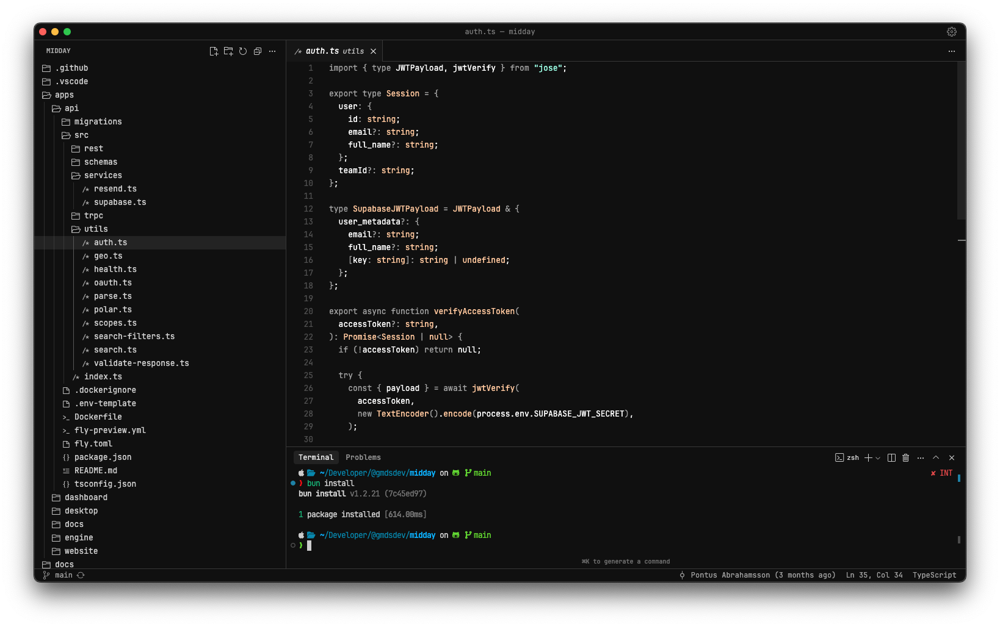

# My setup

All the settings and extensions that I use on a daily basis

- Editor: [Cursor](https://cursor.com/)
- Theme: [Vesper](https://marketplace.cursorapi.com/items/?itemName=raunofreiberg.vesper)
- Icons: [Chalice Icon Theme](https://marketplace.cursorapi.com/items/?itemName=artlaman.chalice-icon-theme)
- Font: [Jetbrains Nerd Font](https://github.com/ryanoasis/nerd-fonts/releases/download/v3.4.0/JetBrainsMono.zip)
- Google Chrome Theme: [Just Black](https://chromewebstore.google.com/detail/just-black/aghfnjkcakhmadgdomlmlhhaocbkloab)

